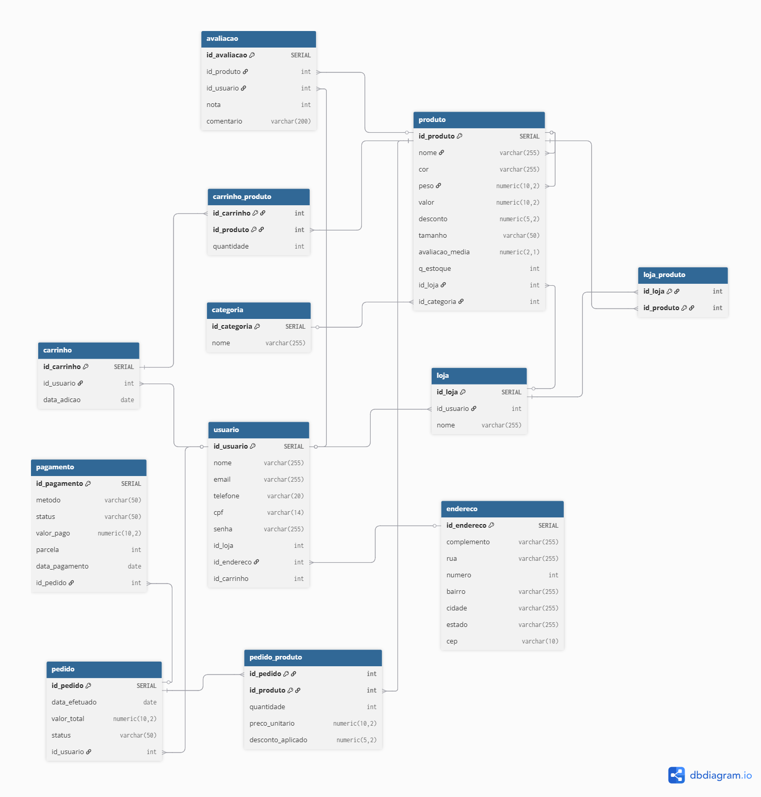

# 🕊️ Free Pigeon — Banco de Dados E‑Market

Este projeto define o esquema de banco de dados relacional para a aplicação **Free Pigeon**, um sistema de e‑commerce (E‑Market) voltado para a compra e venda de produtos.  
O objetivo é garantir **organização**, **integridade referencial** e **escalabilidade**, conectando usuários, produtos, categorias, pedidos, carrinhos e lojas.

---

## 📘 Visão Geral

O banco é estruturado em torno de **usuários**, **produtos**, **categorias**, **pedidos**, **carrinhos** e **lojas**, permitindo:  
- Cadastro e login de usuários;  
- Exibição e compra de produtos;  
- Organização por categorias;  
- Carrinho de compras dinâmico;  
- Registro de pedidos e endereços.  

---

## 🧩 Diagrama Entidade-Relacionamento (ER)

Abaixo está o diagrama que representa todas as tabelas e seus relacionamentos:

  

---

## 🏗️ Estrutura do Banco de Dados

### 1. 🧍‍♂️ `Usuario`
Armazena os dados dos usuários registrados.

| Campo | Tipo | Descrição |
|-------|------|------------|
| `id` | SERIAL (PK) | Identificador único. |
| `nome` | VARCHAR(255) | Nome completo. |
| `email` | VARCHAR(255) | E‑mail único. |
| `senha` | VARCHAR(255) | Senha criptografada. |
| `telefone` | VARCHAR(20) | Telefone de contato. |
| `cpf` | VARCHAR(14) | CPF único. |

---

### 2. 🏠 `Endereco`
Registra os endereços de entrega e cobrança.

| Campo | Tipo | Descrição |
|-------|------|------------|
| `id` | SERIAL (PK) | Identificador. |
| `complemento` | VARCHAR(255) | Detalhes extras. |
| `rua` | VARCHAR(255) | Nome da rua. |
| `numero` | INT | Número. |
| `bairro` | VARCHAR(255) | Bairro. |
| `cidade` | VARCHAR(255) | Cidade. |
| `estado` | VARCHAR(255) | Estado. |
| `cep` | VARCHAR(10) | CEP. |

---

### 3. 🏬 `Loja`
Representa as lojas vendedoras.

| Campo | Tipo | Descrição |
|-------|------|------------|
| `id` | SERIAL (PK) | Identificador da loja. |
| `nome` | VARCHAR(255) | Nome da loja. |
| `descricao` | VARCHAR(255) | Descrição breve. |

---

### 4. 🏷️ `Categoria`
Agrupa os produtos por tipo.

| Campo | Tipo | Descrição |
|-------|------|------------|
| `id` | SERIAL (PK) | Identificador. |
| `nome` | VARCHAR(255) | Nome da categoria. |

---

### 5. 📦 `Produto`
Armazena as informações de cada produto.

| Campo | Tipo | Descrição |
|-------|------|------------|
| `id` | SERIAL (PK) | Identificador. |
| `nome` | VARCHAR(255) | Nome do produto. |
| `cor` | VARCHAR(255) | Cor (opcional). |
| `peso` | NUMERIC(10,2) | Peso. |
| `valor` | NUMERIC(10,2) | Preço. |
| `desconto` | NUMERIC(5,2) | Desconto percentual. |
| `tamanho` | VARCHAR(50) | Tamanho (opcional). |
| `avaliacao_media` | NUMERIC(2,1) | Média de avaliações. |
| `q_estoque` | INT | Quantidade em estoque. |
| `id_loja` | INT (FK) | Loja que vende o produto. |
| `id_categoria` | INT (FK) | Categoria associada. |

---

### 6. 🛒 `Carrinho`
Carrinho de compras ativo de cada usuário.

| Campo | Tipo | Descrição |
|-------|------|------------|
| `id` | SERIAL (PK) | Identificador. |
| `id_usuario` | INT (FK) | Usuário dono do carrinho. |
| `data_adicao` | DATE | Data de criação. |

---

### 7. 🧩 `CarrinhoProduto`
Itens adicionados ao carrinho.

| Campo | Tipo | Descrição |
|-------|------|------------|
| `id_carrinho` | INT (FK, PK) | Carrinho associado. |
| `id_produto` | INT (FK, PK) | Produto adicionado. |
| `quantidade` | INT | Quantidade do produto. |

---

### 8. 🧾 `Pedido`
Pedidos efetuados pelos usuários.

| Campo | Tipo | Descrição |
|-------|------|------------|
| `id` | SERIAL (PK) | Identificador. |
| `data_efetuado` | DATE | Data do pedido. |
| `valor_total` | NUMERIC(10,2) | Valor total. |
| `status` | VARCHAR(50) | Status do pedido. |
| `id_usuario` | INT (FK) | Usuário comprador. |
| `id_endereco` | INT (FK) | Endereço de entrega. |

---

### 9. 🔗 `PedidoProduto`
Relaciona produtos com pedidos.

| Campo | Tipo | Descrição |
|-------|------|------------|
| `id_pedido` | INT (FK, PK) | Pedido associado. |
| `id_produto` | INT (FK, PK) | Produto comprado. |
| `quantidade` | INT | Quantidade comprada. |
| `preco_unitario` | NUMERIC(10,2) | Valor unitário no momento da compra. |
| `desconto_aplicado` | NUMERIC(5,2) | Desconto aplicado. |

---

## 🔗 Relacionamentos Principais

- **Usuário ↔ Carrinho:** 1:1  
- **Carrinho ↔ Produto:** N:M  
- **Usuário ↔ Pedido:** 1:N  
- **Pedido ↔ Produto:** N:M  
- **Produto ↔ Loja:** N:1  
- **Produto ↔ Categoria:** N:1  
